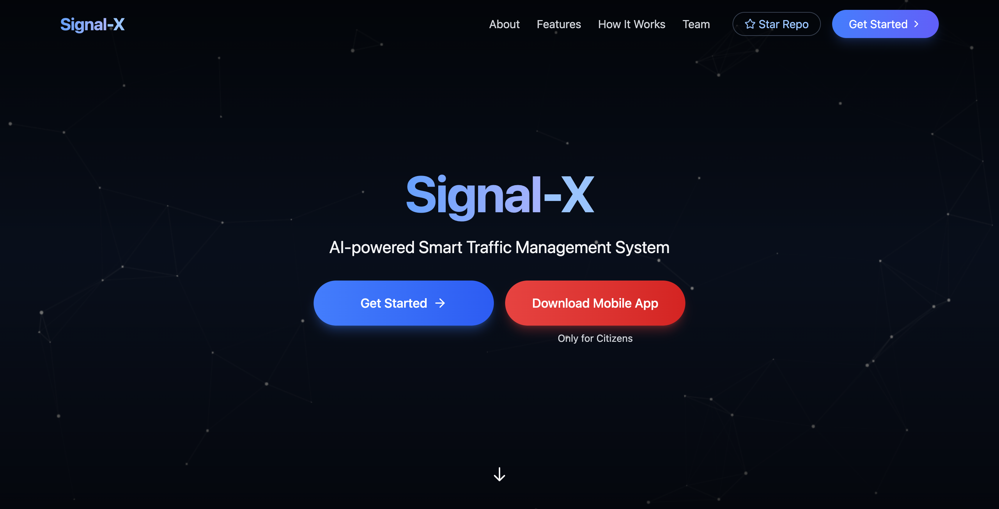
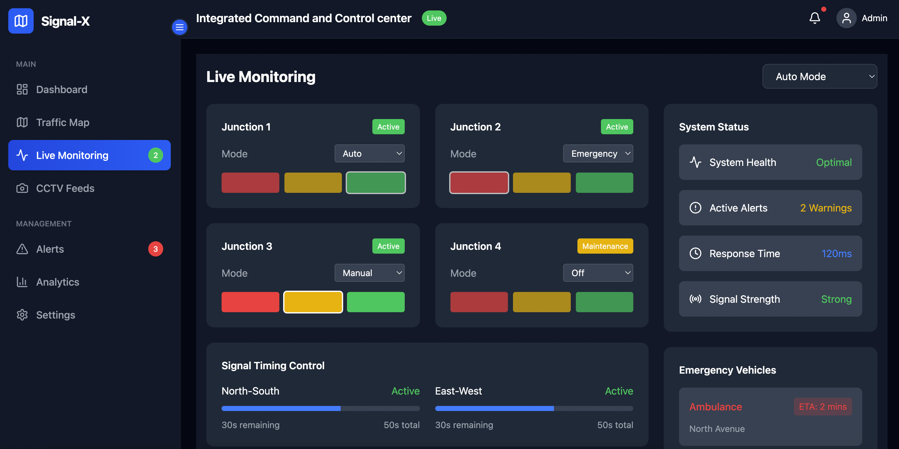
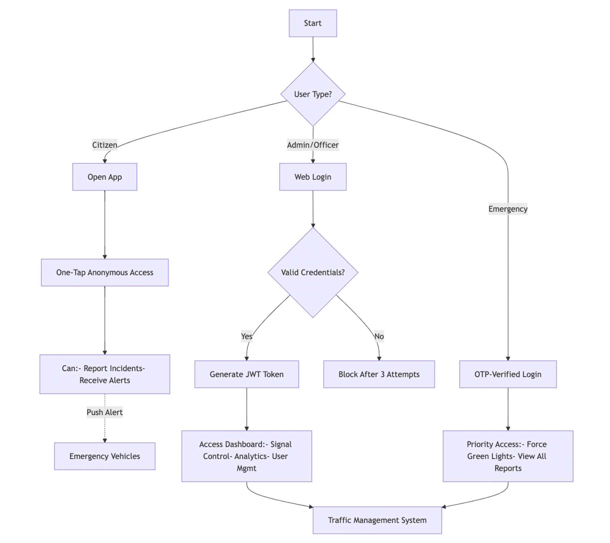
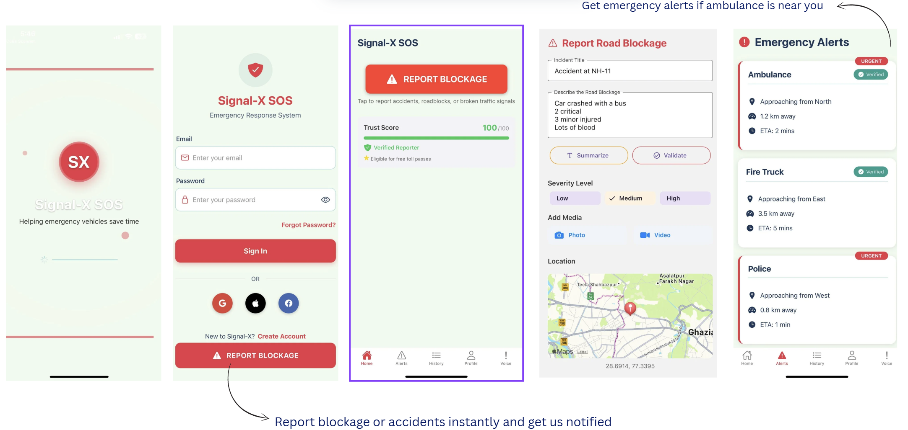

<p align="center">
  
</p>

<p align="center">
  <em>Breaking the Red Tape of Congestion and Inefficiency</em>
</p>|

<div align="center">
  <a href="https://signal-x-zkh5.vercel.app/"target="_blank">
    
  </a>
  <br><br>
  <p style="font-size: 16px; color: #666;">Click the button above to visit the live version of the Signal-X project hosted on Vercel.</p>
</div>

<div align ="center">

[](https://opensource.org/licenses/MIT)
[](https://www.python.org/downloads/)
[](https://reactjs.org/)
[](https://flask.palletsprojects.com/)


<!-- GitHub Repo Badges -->
[](https://github.com/ArshTiwari2004/Signal-X/stargazers)
[](https://github.com/ArshTiwari2004/Signal-X/network/members)
[](https://github.com/ArshTiwari2004/Signal-X/watchers)

<!-- Activity and Stats -->
[](https://github.com/ArshTiwari2004/Signal-X/commits)
[](https://github.com/ArshTiwari2004/Signal-X)
[](https://github.com/ArshTiwari2004/Signal-X)
[](https://github.com/ArshTiwari2004/Signal-X)
[](https://github.com/ArshTiwari2004/Signal-X/graphs/contributors)

<!-- Deployment badge (Optional if deployed) -->
[](https://vercel.com/)

</div>

## 🌟 Overview

Signal-X is an AI-driven smart traffic management system that uses YOLO-based vehicle detection, Arduino-controlled signals, and MapMyIndia’s geospatial analytics to optimize traffic flow in real-time. It prioritizes emergency vehicles, prevents congestion, and enhances road safety through dynamic signal adjustments using live video feeds. Scalable and future-ready, Signal-X is adaptable for cities of all sizes, making urban commuting smarter and more efficient.


## 🚧 Problem Statement

### ❗ The Urban Gridlock Crisis

With rapid urbanization and an ever-increasing number of vehicles, cities are choking under **intense traffic congestion**. What should be smooth commutes turn into daily nightmares, leading to:

- ⏱️ **Wasted Time** stuck in endless queues  
- ⛽ **Higher Fuel Consumption** and rising transportation costs  
- 🌫️ **Increased Pollution** and carbon emissions  
- 🚨 **Delayed Emergency Responses** for ambulances, fire trucks, and police  
- 😠 **Driver Frustration** and rising road rage incidents  

---

### 🚦 The Flaws of Conventional Traffic Lights

Traditional traffic systems follow **fixed-timer logic**, blindly rotating signals **without considering real-time traffic flow**. This outdated mechanism leads to:

- 🟢 **Green lights on empty roads**, wasting valuable intersection time  
- 🔴 **Vehicle pile-ups in busy lanes**, creating bottlenecks  
- 🚑 **Emergency vehicles stuck**, unable to move swiftly through intersections  
- 🧍‍♂️ **Manual control dependency**, requiring more manpower  
- 🧠 **No AI, No Adaptability**, making systems unresponsive and inefficient  

> It’s time to move beyond timers and take the **smart route** to traffic management.

---


## 💡 Our Solution – Signal-X

**Signal-X** is an AI-driven Smart Traffic Management System that transforms urban mobility using the power of **computer vision**, **IoT**, and **geospatial intelligence**. Designed to be **scalable**, **real-time**, and **intelligent**, Signal-X optimizes traffic flow, reduces congestion, and ensures faster emergency response through dynamic signal control.

---

### 🚀 Key Features

- 🧠 **AI-Powered Traffic Analysis**  
  YOLOv8-based object detection continuously monitors vehicle flow across all junction lanes.

- ⏱️ **Dynamic Signal Adjustment**  
  Adaptive signal control based on real-time congestion and traffic density patterns.

- 🌐 **IoT Integration**  
  Raspberry Pi/Arduino-based controllers ensure seamless traffic light control and emergency detection.

- 🗺️ **Geospatial Intelligence**  
  Integration with MapMyIndia's API offers live congestion updates and smart rerouting.

- 🚑 **Emergency Vehicle Prioritization**  
  Automatically detects emergency vehicles (ambulance, fire brigade, police) and gives them green-light priority.

- 🔮 **Congestion Prediction**  
  AI models analyze historical + real-time data to predict and prevent traffic bottlenecks.

---

## 🧩 How Signal-X Works – Workflow

Signal-X operates through a seamless, AI-driven pipeline that integrates video processing, intelligent decision-making, and hardware-level execution.


<table>
  <tr>
    <td align="center">
      <h3>AI Model Processing the Traffic</h3>
      
    </td>
    <td align="center" width="50">
      <h1>➡️</h1>
    </td>
    <td align="center">
      <h3>Result of the Processing Model</h3>
      
    </td>
  </tr>
</table>


---

### ⚙️ Step-by-Step Workflow

1. 🎥 **Live Data Collection**  
   - RTSP streams from **CCTV cameras and drones** provide real-time traffic video feeds.

2. 🗺️ **Traffic API Integration**  
   - Feeds are passed to **MapMyIndia Traffic API** for real-time congestion data enrichment.

3. 🧠 **Vehicle Detection using YOLOv8**  
   - Vehicles are identified and classified into 5 categories:  
     🚑 Ambulance, 🧬 Organ Transport, 🚒 Fire Brigade, 🚓 Police, 🆘 Disaster Units

4. 🔄 **Real-Time Multiprocessing**  
   - Uses Python’s **multiprocessing** to analyze **all four lanes** at a junction simultaneously for accurate density analysis.

5. 🧮 **Smart Signal Optimization**  
   - A custom AI model determines the optimal green-light timing using:  
     - 📊 **Vehicle Density**  
     - 🕓 **Historical Traffic Patterns** (via Reinforcement Learning)  
     - 📡 **Live API Congestion Data**

6. 🔌 **IoT-Based Hardware Integration**  
   - Arduino module integrated into the junction system.  
   - If an emergency vehicle is detected, **immediate green signal** is activated and maintained until it passes.

7. 🖥️ **Real-Time Dashboard (React)**  
   - Officers monitor and visualize traffic flow and system decisions via a **React-based dashboard** in real-time.

---

### 🎯 Why Signal-X?

> Unlike traditional fixed-timer systems, Signal-X uses **real-time intelligence and automation** to enhance traffic efficiency, reduce delays, and save lives.

✅ Smart  
✅ Scalable  
✅ Emergency-Ready  
✅ Real-Time  
✅ AI-Optimized  

## 🔧 Technical Architecture

### Components Overview

1. **Data Collection Layer**
   - CCTV cameras & drones capture live video feeds
   - Microphone sensors detect emergency vehicle sirens
   - IoT devices (Raspberry Pi & Arduino) process sensor inputs

2. **AI Processing Layer**
   - YOLOv8 for vehicle detection and classification
   - DeepSORT for vehicle tracking
   - OpenCV for image processing
   - Flask for API management

3. **Backend Processing**
   - MongoDB for data storage
   - WebSocket for real-time communication
   - Traffic analysis algorithms

4. **Frontend Dashboard**
   - React-based responsive interface
   - Real-time traffic analytics visualization
   - MapMyIndia integration for geospatial display

5. **Signal Control System**
   - Priority-based signal switching for emergency vehicles
   - Adaptive traffic light control based on congestion analysis

## 💻 Technology Stack

## 🧰 Tech Stack – What Powers Signal-X 🚦

Signal-X is built using a powerful blend of **AI, hardware, geospatial analytics, real-time systems, and scalable web technologies**. Here's everything under the hood:

---

### 🌐 Frontend – **React Dashboard**

| Tech | Purpose |
|------|---------|
| ⚛️ React.js | Dynamic, component-based UI |
| 🗺️ MapMyIndia SDK | Interactive maps & live traffic visualization |
| 🌈 Tailwind CSS | Modern utility-first styling |
| 📡 WebSocket | Real-time UI updates & traffic stats |
| 🔗 Axios | API requests and data fetching |
| 📱 React Native (Expo) | Mobile traffic monitor app (optional extension) |

---

### 🧠 AI & Computer Vision – **Smart Traffic Brain**

| Tech | Purpose |
|------|---------|
| 🧠 YOLOv8 | High-speed vehicle detection & classification |
| 🎥 OpenCV (cv2) | Image & video stream processing |
| 📊 NumPy, SciPy | Traffic data analytics |
| 📈 Matplotlib | Data visualization and graphs |
| 🔬 Ultralytics | YOLOv8 training and inference |
| 🧠 Reinforcement Learning | Intelligent signal timing optimization |

---

### 🧪 Backend – **Core Logic & APIs**

| Tech | Purpose |
|------|---------|
| 🐍 Flask | RESTful API backend (Python) |
| 🌐 WebSocket (Flask-SocketIO) | Real-time data sync with frontend |
| 🍃 MongoDB | NoSQL database for storing traffic history & logs |
| ⚙️ Express.js + Node.js | API support for mobile & hardware integrations |

---

### 🔌 Hardware – **IoT-Powered Signal Controller**

| Component | Role |
|-----------|------|
| 💡 Arduino UNO | Signal & sensor control unit |
| 🔊 CZN15E Sound Sensor | Detects approaching emergency sirens |
| 🎥 OV7670 Camera Module | Captures live video for CV analysis |
| 📏 HC-SR04 Ultrasonic Sensor | Measures distance & lane occupancy |
| 💡 LEDs, 🧲 Buzzer, 🔌 Jumper Wires, 🔳 Breadboard | Circuit components for signal light system |
| 🧠 Arduino IDE + Embedded C/C++ | Logic programming and testing |
| 🖥️ Serial Monitor | Debugging and communication with PC |

---

### 🎮 Bonus Tools & Utilities

| Tool | Use |
|------|-----|
| 🧩 Pygame | Simulating traffic flow for testing |
| 📈 Scikit-learn | Optional ML utilities |
| 🧪 Matplotlib | Data analysis visualization |
| 🧠 Gemini API | Optional AI assistance (integration idea) |

---

> 🚀 Signal-X combines **real-world sensors**, **cutting-edge AI**, and **cloud-based data pipelines** to create a future-ready traffic management solution.

---

## 🚀 Getting Started

### Prerequisites
- Python 3.8+
- Node.js and npm
- MongoDB
- MapmyIndia API key
- Gemini API key 
- Arduino IDE 


### Installation

1. **Clone the repository**
   ```bash
   git clone https://github.com/ArshTiwari2004/Signal-X.git
   cd Signal-X
   ```
2. **Setup Frontend**
    ```bash
    cd traffic-monitoring/frontend/web/signalx-web
    npm install
    ```
3. **Create a .env file in the root of the frontend directory with:**
    ```bash
    VITE_MAPPLS_SDK_KEY=your_mapmy_india_sdk_key
    ```
4. **Start the development server:**
    ```
    npm run dev
    ```
5.  **Setup Backend - Create and activate a virtual environment:**
    ```
    python -m venv venv
    venv\Scripts\activate  # Windows
    source venv/bin/activate  # Linux/Mac
    ```
6. **Install the required packages:**
    ```
    pip install -r requirements.txt
    ```
7. **Start the Flask server:**
    ```
    python backend/flask_api.py
    ```
8. **For running the Expo project on mobile**
   ```
   cd mobile-app/signalx-mobile
   npm i
   ```
9. **Set up your GEMINI_API_KEY in .env**
   ```
   VITE_GEMINI_API_KEY=your_gemini_api_key
   ```
10. **Run the app**
   ```
   npx expo start
   ```
11. **Setting up the expo backend**
   ```
   cd mobile-app/mobile-backend
   npm i 
   ```
12. **Set up env variables for expo backend**
    ```
     TWILIO_ACCOUNT_SID=your_twilio_account_sid_here
     TWILIO_AUTH_TOKEN=your_twilio_auth_token_here 
     TWILIO_PHONE_NUMBER=your_twilio_phone_number_here 
     MONGO_URI=your_mongodb_connection_string_here
    ```

13. **Run the Mobile Backend Server**
    ```
    npm run dev 
    ``` 
14. **Setup the Arduino IDE**
    
```bash 
# ⚙️ How to Upload 
1. Open the `.ino` files using the Arduino IDE. 
2. Select the correct board and port: - Tools > Board > (e.g., Arduino UNO) - Tools > Port > (Select the connected COM port) 
3. Connect your Arduino (e.g., UNO, Nano, etc.) via USB. 
4. Click the "Upload" button in the Arduino IDE (➡️ icon). 
5. Ensure all required components (Servo motors, LEDs, Buzzer, etc.) are connected as per the logic in the code. 
```


# Project Structure

```bash
signal-x/
├── Arduino_code/
│   ├── sketch_Camera/
│   │   └── sketch_Camera.ino           # Controls CCTV pan/tilt
│   └── sketch_LED_Buzzer/
│       └── sketch_LED_Buzzer.ino       # Controls signal lights & alarms
│
├── mobile-app/
│   ├── mobile-backend/
│   │   ├── config/
│   │   │   ├── db.js                   # MongoDB connection
│   │   │   └── dotenv.js               # API keys config
│   │   ├── models/
│   │   │   ├── Incident.js             # Report schema
│   │   │   └── User.js                 # Auth schema
│   │   └── routes/
│   │       ├── authRoutes.js           # Login/register endpoints
│   │       └── incidentRoutes.js       # Report submission
│   │
│   └── signalx-mobile/
│       ├── components/
│       │   ├── EmergencyAlert.js       # Siren detection UI
│       │   └── LiveTrafficLight.js     # Real-time signal status
│       └── screens/
│           ├── HomeScreen.js           # Main dashboard
│           └── ReportScreen.js         # Incident form
│
├── traffic-monitoring/
│   ├── backend/
│   │   ├── templates/                  # Admin panel HTML
│   │   ├── ambulance_detection.py      # Priority vehicle logic
│   │   └── traffic_control.py          # Signal timing algorithms
│   │
│   ├── frontend/
│   │   └── web/
│   │       └── signalx-web/
│   │           └── src/
│   │               ├── components/     # Reusable UI elements
│   │               ├── pages/          # Route-specific pages
│   │               └── routes/         # Navigation config
│   │
│   ├── models/                         # AI models
│   │   ├── yolov8n.pt                 # Vehicle detection weights
│   │   └── siren_detection.h5         # Audio classification
│   │
│   ├── simulations/                    # Traffic simulations
│   │   ├── rippling_effect.py         # Congestion spread model
│   │   └── traffic_simulator.py       # Junction flow simulator
│   │
│   ├── utils/                          # Utility scripts
│   │  
│   │                  
│   │
│   ├── alert.wav                      # Emergency sound
│   ├── dashboard.png                  # Admin UI mockup
│   └── README.md                      # Setup instructions

```


## 🖼️ Snippets 
*Landing page of Signal-X*


*Dashboard of Signal-X*


*Auth workflow*


*Snapshots of the Citizen App*



## 🔮 Future Enhancements

## 1. **AI-Powered Red-Light Violation Detection** : 
- Use AI-based license plate recognition to detect vehicles running red lights. Integrated with government databases, the system can auto-generate challans, improving law enforcement efficiency.

## 2. **Smart Signal Optimization with Reinforcement Learning**: 
- Leverage reinforcement learning to optimize signal timings based on real-time and historical traffic data, ensuring faster clearance for emergency vehicles and smoother traffic flow.

## 3. **AI-Based Incident Detection & Rerouting**:
- Utilize AI to detect accidents or breakdowns via CCTV analysis. The system can instantly alert authorities and reroute traffic to prevent congestion.


## 🤝 Contributing
#### Contributions are welcome! Please feel free to submit a Pull Request.

- Fork the repository
- Create your feature branch (git checkout -b feature/amazing-feature)
- Commit your changes (git commit -m 'Add some amazing feature')
- Push to the branch (git push origin feature/amazing-feature)
- Open a Pull Request


**❤️ Made with love by Team Synapse — Arsh Tiwari, Priyanshi Bothra, and Nibedan Pati**


📩 Have a suggestion or want to connect? Drop a mail at: arshtiwari12345@gmail.com
