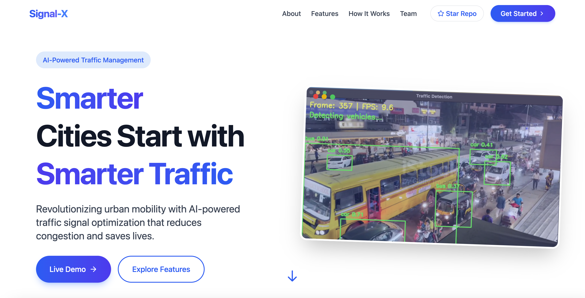

# Signal-X: AI-powered Smart Traffic Management System

<p align="center">
  <em>AI-powered Smart Traffic Management System</em>
</p>|

<div align="center">
  <a href="https://signal-x-kappa.vercel.app/" target="_blank">
    
  </a>
  <br><br>
  <p style="font-size: 16px; color: #666;">Click the button above to visit the live version of the SignalX project hosted on Vercel.</p>
</div>

<div align ="center">

[](https://opensource.org/licenses/MIT)
[](https://www.python.org/downloads/)
[](https://reactjs.org/)
[](https://flask.palletsprojects.com/)

</div>

## 🌟 Overview

Signal-X is an AI-driven Smart Traffic Management System designed to revolutionize urban mobility by integrating computer vision, IoT, and geospatial intelligence. Our solution addresses the critical challenges of urban traffic congestion through real-time monitoring, analysis, and optimization.

## 🚦 Problem Statement

Urban traffic congestion is a major challenge, leading to:
- Delays and wasted time
- Increased fuel consumption and pollution
- Higher accident rates
- Emergency vehicle delays
- Inefficient traffic flow

Conventional traffic lights operate on fixed timers which do not adapt to real-time traffic conditions. This causes:
- Wasted green lights on empty lanes
- Vehicle pile-ups in congested directions
- Long queues and increased delays
- Emergency vehicle struggles in critical situations
- Outdated systems compared to modern smart adaptive solutions

## 💡 Our Solution

Signal-X revolutionizes traffic management through:
- **AI-driven traffic analysis** - YOLO-based vehicle detection continuously monitors traffic flow
- **Dynamic signal adjustment** - Traffic lights adapt in real-time based on congestion patterns
- **IoT integration** - Raspberry Pi-powered signal controllers ensure seamless optimization
- **Geospatial intelligence** - MapMyIndia integration provides real-time navigation and alternative routes
- **Emergency vehicle prioritization** - Automatic detection and signal adjustment for emergency vehicles
- **Congestion prediction** - AI models analyze patterns to prevent bottlenecks before they occur

## 🔑 Core Features

- ✅ **AI-based Real-time Traffic Light Control**
  - Monitors traffic density and adjusts signal timings dynamically
  - Reduces wait times and improves traffic flow efficiency

- ✅ **Emergency Vehicle Detection & Prioritization**
  - Detects sirens and visual identification of emergency vehicles
  - Automatically adjusts signals to create green corridors

- ✅ **Live Traffic Congestion Heatmap**
  - Visualizes congestion levels across the monitored area
  - Helps users identify and avoid traffic hotspots

- ✅ **Citizen Mobile Alert & Reporting System**
  - Sends real-time alerts to citizens about road blockages and emergency routes
  - Allows users to report road blockages or congestion, helping authorities and ambulances find alternative routes

- ✅ **Traffic Flow Predictions**
  - Analyzes historical data to predict future congestion patterns
  - Enables proactive traffic management strategies

## 🔧 Technical Architecture

### Components Overview

1. **Data Collection Layer**
   - CCTV cameras & drones capture live video feeds
   - Microphone sensors detect emergency vehicle sirens
   - IoT devices (Raspberry Pi & Arduino) process sensor inputs

2. **AI Processing Layer**
   - YOLOv8 for vehicle detection and classification
   - DeepSORT for vehicle tracking
   - OpenCV for image processing
   - Flask for API management

3. **Backend Processing**
   - MongoDB for data storage
   - WebSocket for real-time communication
   - Traffic analysis algorithms

4. **Frontend Dashboard**
   - React-based responsive interface
   - Real-time traffic analytics visualization
   - MapMyIndia integration for geospatial display

5. **Signal Control System**
   - Priority-based signal switching for emergency vehicles
   - Adaptive traffic light control based on congestion analysis

## 💻 Technology Stack

### Frontend
- **React** - UI library for building the dashboard
- **MapMyIndia SDK** - For maps integration and geospatial visualization
- **WebSocket** - For real-time communication with the backend

### Backend
- **Flask** - Python web framework for the API
- **MongoDB** - Database for storing traffic data and patterns
- **WebSocket** - For real-time data transmission

### AI & Computer Vision
- **YOLOv8** - For real-time object detection
- **DeepSORT** - For object tracking
- **OpenCV** - For image processing
- **Python** - Primary programming language

### Hardware
- **Raspberry Pi** - For edge computing and signal control
- **Arduino** - For sensor integration
- **CCTV Cameras** - For traffic monitoring

## 🚀 Getting Started

### Prerequisites
- Python 3.8+
- Node.js and npm
- MongoDB
- MapMyIndia API key

### Installation

1. **Clone the repository**
   ```bash
   git clone https://github.com/priyanshi0609/SignalX.git
   cd signalX
   ```
2. **Setup Frontend**
    ```bash
    cd traffic-monitoring/frontend/web/signalx-frontend
    npm install
    ```
3. **Create a .env file in the root of the frontend directory with:**
    ```bash
    VITE_MAPPLS_SDK_KEY=your_mapmy_india_sdk_key
    ```
4. **Start the development server:**
    ```
    npm run dev
    ```
5.  **Setup Backend - Create and activate a virtual environment:**
    ```
    python -m venv venv
    venv\Scripts\activate  # Windows
    source venv/bin/activate  # Linux/Mac
    ```
6. **Install the required packages:**
    ```
    pip install -r requirements.txt
    ```
7. **Start the Flask server:**
    ```
    python backend/flask_api.py
    ```
8. **For running the Expo project on mobile**
   ```
   cd mobile-app/signalx-mobile
   npm i
   npx expo start
   ```

# Project Structure
```bash
signalX/
├── .git/
├── .vscode/
├── traffic-monitoring/
│   ├── backend/
│   │   ├── flask_api.py           # Main Flask API (REST + WebSocket)
│   │   ├── traffic_control.py     # Signal timing logic
│   │   ├── traffic_detection.py   # YOLO+DeepSORT vehicle tracking
│   │   ├── emergency_handler.py   # Ambulance detection (audio/siren analysis)
│   │   ├── models/
│   │   │   ├── yolo/              # Custom-trained YOLOv8n (Indian vehicles)
│   │   │   └── siren_detection.h5 # Audio model (TF/Keras)
│   │   ├── utils/
│   │   │   ├── mapmyindia.py      # API integration
│   │   │   └── alerts.py          # Firebase FCM push notifs
│   │   └── traffic-data.csv       # Historical logs
│   ├── frontend/                  # React dashboard
│   │   ├── public/
│   │   ├── src/
│   │   │   ├── components/
│   │   │   │   ├── Heatmap.jsx    # Live congestion view
│   │   │   │   └── SignalControl.jsx # Manual override UI
│   │   │   └── App.jsx
│   ├── simulation/
│   │   ├── traffic_simulator.py   # Pygame intersection sim
│   │   └── visualization.py       # Matplotlib analytics
│   └── temp-audio/                # Siren audio cache
├── mobile-app/                     # Expo+React Native
│   ├── components/
│   │   ├── ReportButton.js        # One-tap reporting
│   │   └── AlertFeed.js           # Emergency notifications
│   ├── App.js
│   └── emergency_api.js           # WebSocket connection
├── README.md                       # Documentation
└── requirements.txt                 # Dependencies

```
## 🖼️ Snippets 
*Landing page of Signal-X*


*Dashboard of Signal-X*


*Auth workflow*


*Snapshots of the Citizen App*


## 🔮 Future Enhancements

- AI-powered license plate recognition 
- Reinforcement learning can optimize signal patterns dynamically based on historical and real-time traffic flow
- Detect accidents or vehicle breakdowns.


## 🤝 Contributing
#### Contributions are welcome! Please feel free to submit a Pull Request.

- Fork the repository
- Create your feature branch (git checkout -b feature/amazing-feature)
- Commit your changes (git commit -m 'Add some amazing feature')
- Push to the branch (git push origin feature/amazing-feature)
- Open a Pull Request
